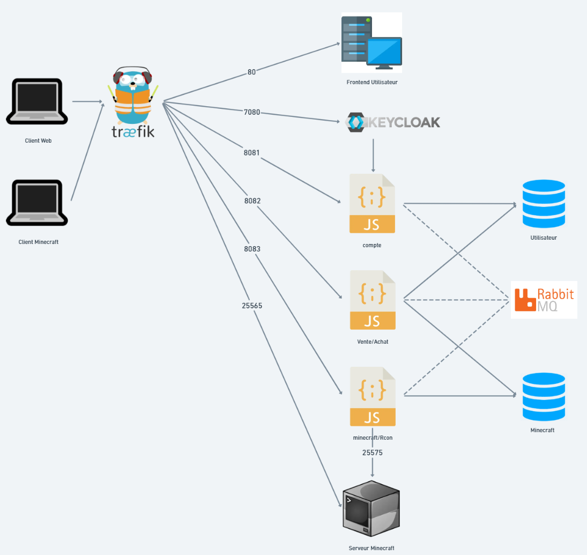
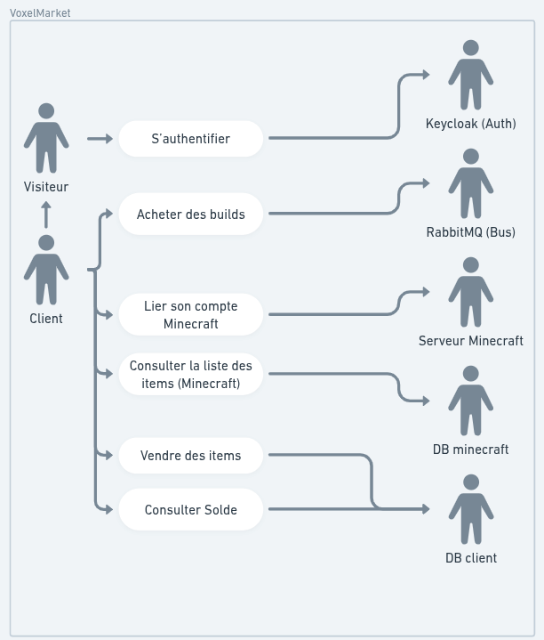
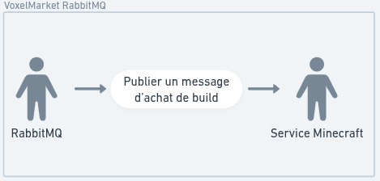
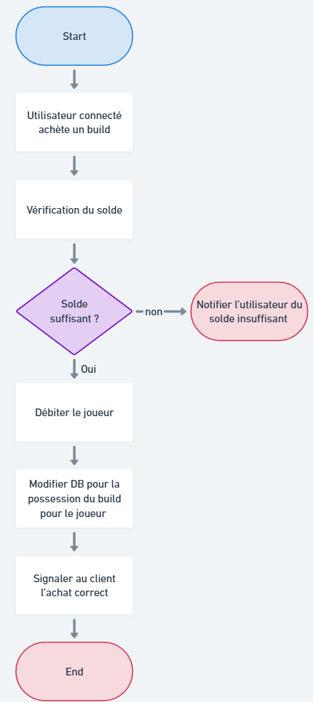
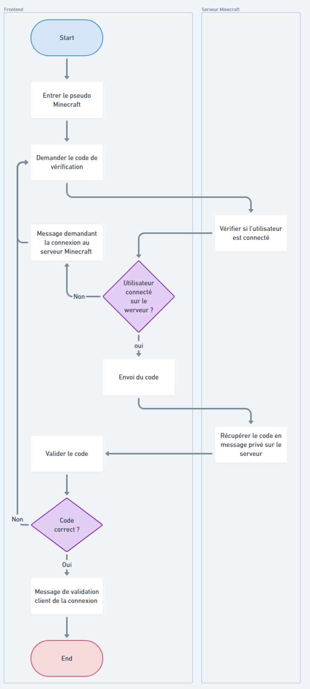
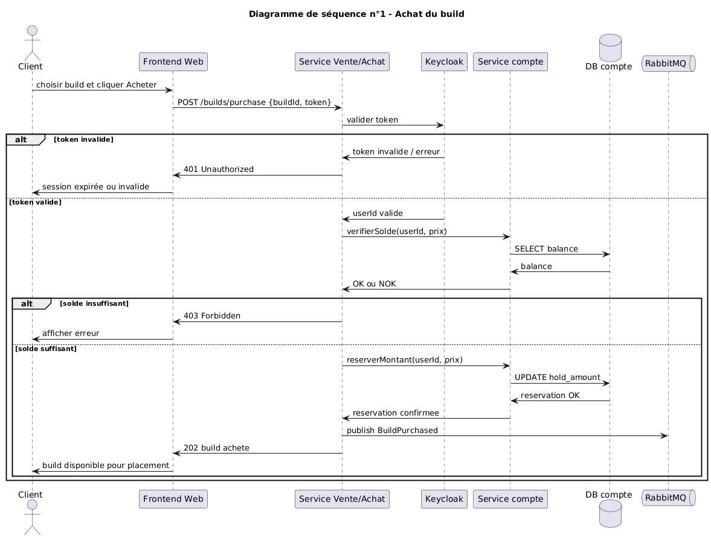
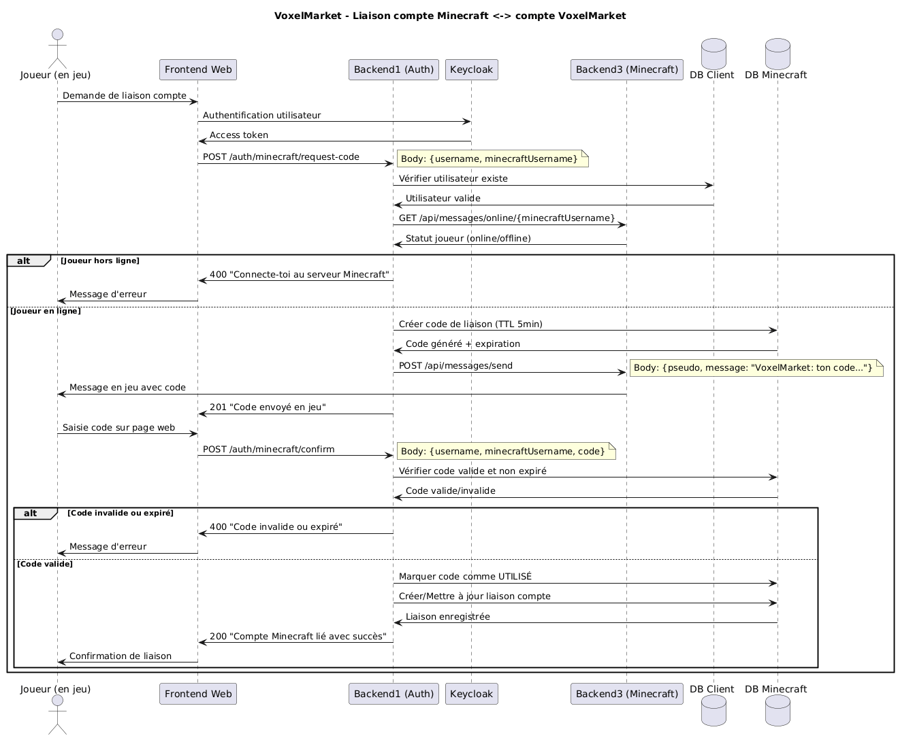
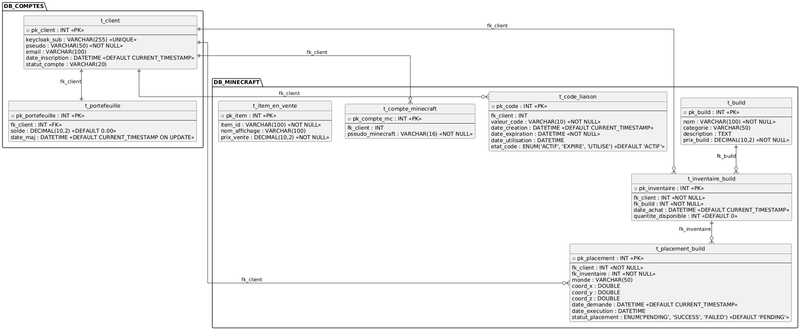

# 321 - Programming Distributed Systems

- [321 - Programming Distributed Systems](#321---programming-distributed-systems)
  - [Project Launch](#project-launch)
    - [Prerequisites](#prerequisites)
    - [Quick Start](#quick-start)
    - [Urls Guide:](#urls-guide-)
    - [Shutdown](#shutdown)
  - [Analysis](#analysis)
    - [Context Description](#context-description)
    - [Application Principle Diagram](#application-principle-diagram)
      - [Microservices:](#microservices-)
    - [Use Case Diagram](#use-case-diagram)
    - [Activity Diagram #1](#activity-diagram-1)
    - [Activity Diagram #2](#activity-diagram-2)
  - [Design](#design)
    - [Global Architecture](#global-architecture)
    - [Sequence Diagram #1](#sequence-diagram-1)
    - [Sequence Diagram #2](#sequence-diagram-2)
    - [Database Relational Schemas](#database-relational-schemas)
    - [Tests Design](#tests-design)
  - [Implementation](#implementation)
    - [Code Dive #1](#code-dive-1)
      - [Feature: Buying a build (starting from the backend)](#feature-buying-a-build-starting-from-the-backend)
        - [1. Backend2 API Entry (marketRoutes.js)](#1-backend2-api-entry-marketroutesjs)
        - [2. Payload Validation (requestValidation.js)](#2-payload-validation-requestvalidationjs)
        - [3. Backend2 Controller (marketController.js)](#3-backend2-controller-marketcontrollerjs)
        - [4. Backend2 Business Service (marketService.js)](#4-backend2-business-service-marketservicejs)
        - [4.1 SQL Wallet Locking (Backend1)](#41-sql-wallet-locking-backend1)
        - [5. RabbitMQ Publishing (rabbitMqService.js)](#5-rabbitmq-publishing-rabbitmqservicejs)
        - [6. Backend3 Consumption (buildPurchaseConsumer.js)](#6-backend3-consumption-buildpurchaseconsumerjs)
        - [7. In-Game Application via RCON (Backend3)](#7-in-game-application-via-rcon-backend3)
    - [Code Dive #2](#code-dive-2)
      - [Feature: Minecraft Inventory Retrieval](#feature-minecraft-inventory-retrieval)
        - [1. Frontend Initiation (inventory.html / app.js)](#1-frontend-initiation-inventoryhtml--appjs)
        - [2. API Call (inventoryService.js)](#2-api-call-inventoryservicejs)
        - [3. Backend3 Routing (inventoryRoutes.js)](#3-backend3-routing-inventoryroutesjs)
        - [4. Backend3 Controller (inventoryController.js)](#4-backend3-controller-inventorycontrollerjs)
        - [5. RCON Service (rconService.js)](#5-rcon-service-rconservicejs)
        - [6. Items Normalization](#6-items-normalization)
        - [7. Frontend Display (inventoryView.js)](#7-frontend-display-inventoryviewjs)
    - [Encountered Issues](#encountered-issues)
    - [Improvements](#improvements)
    - [Limitations and Shortcomings Due to Time Constraints](#limitations-and-shortcomings-due-to-time-constraints)
  - [Tests](#tests)
    - [Test Results](#test-results)
    - [POSTMAN Requests](#postman-requests)
      - [Main Endpoints](#main-endpoints)
      - [Requests with Parameters](#requests-with-parameters)
  - [Conclusion](#conclusion)
    - [Objectives Achievement](#objectives-achievement)
    - [Delivered Features](#delivered-features)
    - [Developed Technical Skills](#developed-technical-skills)
    - [Global Vision](#global-vision)


Project implementing all the concepts related to programming distributed systems. This module aims to develop and implement the following skill: analyzing, understanding, planning, extending, and using distributed systems, and then transferring existing applications to a distributed architecture.

**Pedagogical Objectives:**

1. Analyze software systems presenting a different structure and transfer them to distributed systems.
2. Use system components in distributed systems.
3. Link system parts via well-defined interfaces.
4. Implement system components in a distributed system and verify their operation.

## Project Launch

### Prerequisites

- Docker Desktop (with Docker Compose)
- Node.js 18+ (if you are also running services outside Docker)
- Minecraft Client (Version 1.21.1 for startup)
- Internet connection
- Server IP: localhost:25565

### Quick Start

From the project root:

```bash
docker compose up -d
```

Launch Minecraft in 1.21.1 and join the server through the multiplayer menu using the IP. (Joining the server might take a little time, the server needs to fully start)

### Urls Guide:

- Backend 1 (Account Api): localhost:3001
- Backend 2 (VoxelMarket): localhost:3002
- Backend 3 (Minecraft Service): localhost:3003
- PhpMyAdmin: localhost:8080
- Prometheus: localhost:9090
- Grafana: localhost:3004
- Loki: localhost:3100
- Frontend: localhost:8081
- Minecraft Server: localhost:25565
- Keycloak: localhost:7080

Backend health check with the /health prefix.
Prometheus metrics are exposed on /metrics for the three backends and for MySQL via the dedicated exporter.

### Shutdown

```bash
docker compose down
```

## Analysis

### Context Description

VoxelMarket is an in-game monetization solution based on an asynchronous microservices architecture. By linking their identity via Keycloak, players turn their physical efforts (mining) into virtual currency stored in a database. The economic flow is intentionally unidirectional: players sell their items to the system to earn coins, then use these coins to buy builds offered by the system. Transactions go through RabbitMQ to ensure reliable exchanges, even in the event of a temporary game server disconnection.

### Application Principle Diagram

<!--
    The diagram should remain intentionally simple and not go into technical details.
    The goal is to give an overview of the application's architecture.

    Then add a few lines of explanation to describe the main elements
    of the diagram and the role of each entity in the application.
-->



#### Microservices:

- **Account**: Manages the creation and login of users. Authenticates players with the Minecraft server by communicating with the Minecraft/Rcon microservice to send verification codes.
- **Sale/Purchase**: Manages the sale of items by players to the system and the purchase of builds (constructions) by players. Communicates with Minecraft/Rcon to retrieve the inventory and uses RabbitMQ queues for transactions.
- **Minecraft/Rcon**: Acts as the link between the Minecraft server and the other microservices. Consumes item sale and build purchase/placement queues, then sends instructions to the game. Also retrieves player information.
- **Keycloak**: Handles authentication and login.
- **Traefik**: Manages load balancing across services and containers.
- **RabbitMQ**: Manages the transmission of asynchronous requests.

### Use Case Diagram



**Business Actors:**

- **Visitor**: Unidentified user with access to basic authentication.
- **Client**: Authenticated user inheriting the Visitor role, with access to interactive and economic features.

**Infrastructure Systems:**

- **Keycloak** (Auth): Identity provider centralizing security.
- **RabbitMQ** (Bus): Message broker ensuring asynchronous communication.
- **Minecraft Server**: Game environment where physical actions take place.
- **Database**: Persistent storage system for the wallet and data.



### Activity Diagram #1

<!--
    APPRENTICE TODO:
    A UML activity diagram represents the different steps
    of a process or feature in an application.

    Create an activity diagram here describing the flow of a
    feature of your application. This diagram should show the
    main actions, potential decisions, and the process flow.

    This first activity diagram must be done by one of the two apprentices.
-->

**Feature**: Placing a build



### Activity Diagram #2

**Feature**: Linking the Minecraft account to the VoxelMarket account



## Design

### Global Architecture

<!--
    It must particularly include the different microservices, clients, databases
    as well as the infrastructure services used (for example: Traefik, Keycloak, RabbitMQ,
    Prometheus, Grafana, etc.).

    Links between different services must be clearly visible, along with the ports
    used for communications.

    The diagram must provide a clear vision of the system's overall organization.
    Then complete this diagram with detailed explanations describing the role of the different
    components and how they interact in the application's global architecture.
-->


### Sequence Diagram #1

<!--
    APPRENTICE TODO:
    A UML sequence diagram represents interactions between
    different components of a system over time during the execution
    of a feature.

    Create a sequence diagram here for one of your application's
    features. This diagram must show the exchanges between the different
    system elements (client, microservices, database, etc.) and the
    order in which these interactions occur.

    This first sequence diagram must be done by one of the two apprentices.
-->



### Sequence Diagram #2

<!--
    APPRENTICE TODO:
    Create a second UML sequence diagram for another feature
    of your application.

    Refer to the explanations given in the previous chapter regarding
    the sequence diagram. This diagram must show the interactions between
    the different system components and the order in which they occur.

    This second sequence diagram must imperatively be done by the
    second apprentice.
-->



### Database Relational Schemas

<!--
    APPRENTICE TODO:
    A database relational schema represents the structure
    of a relational database. It shows the different tables,
    their attributes, primary keys, and the relationships between tables.

    Create the relational schema of the databases used in your project here.
    All databases implemented in the application must be represented.

    Tables, their primary keys, foreign keys, and relationships between
    tables must clearly appear in the diagram.

    Complete this diagram with detailed explanations allowing an understanding
    of data organization, the role of different tables, and existing relationships
    between them.
-->



### Tests Design

<!--
    APPRENTICE TODO:
    In this chapter, you must develop the test design of your application.

    The goal is to define in a structured way the tests that will verify
    the proper functioning of your entire system. All parts of your
    application must be taken into account (clients, microservices, API, databases, etc.).

    Present your tests in a table format containing at least the following elements:
    - a test number
    - a clear description of the test to perform
    - the expected result

    Tests must cover the different important features of the application
    to demonstrate that the system works correctly in various use cases.
-->

The tests below cover the critical paths of VoxelMarket: security, inter-service integration, data persistence, and asynchronous processing via RabbitMQ.

| Test # | Description                                                                                                    | Expected Result                                                                                             |
| :----: | -------------------------------------------------------------------------------------------------------------- | ------------------------------------------------------------------------------------------------------------ |
|  T01   | Authenticate a user via Keycloak with valid credentials.                                                       | User is authenticated, a valid token is returned, and protected routes are accessible.                       |
|  T02   | Attempt authentication with invalid credentials.                                                               | Access is denied, no valid token is issued.                                                                  |
|  T03   | Generate a Minecraft linking code from the in-game plugin.                                                     | A unique code is created with an expiration date and stored in the database.                                 |
|  T04   | Confirm Minecraft linking with a valid code on the Web side.                                                   | The VoxelMarket account is linked to the corresponding Minecraft account and the state is persisted in the database. |
|  T05   | Confirm linking with an expired or invalid code.                                                               | Linking is denied with an explicit error message, without database modification.                             |
|  T06   | Check the wallet balance of an authenticated user.                                                             | The returned balance matches the value stored in the database.                                               |
|  T07   | Sell items to the system with a valid quantity in the inventory.                                               | Items are removed from the inventory, the wallet is credited, and the sale transaction is recorded.          |
|  T08   | Buy a build with sufficient balance.                                                                           | The amount is reserved/debited according to the flow, purchase is recorded, and a placement request is published. |
|  T09   | Buy a build with insufficient balance.                                                                         | Purchase is denied, no debit is made, and no placement event is published.                                   |
|  T10   | Trigger a build placement from the client (in-game command).                                                   | The request is accepted, the event is published, then processed by the placement plugin.                     |
|  T11   | Successful placement on the Minecraft server side.                                                             | The status changes to successful, the transaction is finalized, and the client receives a confirmation.      |
|  T12   | Verify RabbitMQ message persistence during a temporary unavailability of a consumer service.                   | The message remains in the queue and is processed as soon as the service returns, without transaction loss.  |
|  T13   | Test access to an API protected route without a token.                                                         | The API responds with an access denial (401/403) and no business action is executed.                         |
|  T14   | Verify data integrity after a complete cycle linking + item sale + purchase + placement.                   | The concerned tables are consistent (linking, sale, purchase, wallet, placement status).                     |
|  T15   | Test light load (simultaneous item sales and build purchases for the same user).                               | The system responds without balance inconsistency, inventory inconsistency, or critical processing duplication. |

## Implementation

### Code Dive #1

#### Feature: Buying a build (starting from the backend)

This code dive follows the backend execution of buying a build, from the Backend2 API entry to the asynchronous processing in Backend3 via RabbitMQ.

##### 1. Backend2 API Entry (marketRoutes.js)

The entry point is the purchase route:

```javascript
router.post("/achat", validateAchat, marketController.achat);
```

The route first applies `validateAchat` to ensure a correct payload (`userId`, `buildId`/`itemId`, `quantity` in positive integers), then delegates to the controller.

##### 2. Payload Validation (requestValidation.js)

The middleware normalizes the request and also accepts `itemId` as an alias for `buildId`:

```javascript
function validateAchat(req, res, next) {
  try {
    const buildIdInput = req.body?.buildId ?? req.body?.itemId;
    req.body = {
      ...(req.body || {}),
      userId: parsePositiveInt(req.body?.userId, "userId"),
      buildId: parsePositiveInt(buildIdInput, "buildId"),
      quantity: parsePositiveInt(req.body?.quantity, "quantity")
    };
    next();
  } catch (error) {
    next(error);
  }
}
```

##### 3. Backend2 Controller (marketController.js)

The controller remains lightweight: it passes the data to the business service with the Keycloak authorization header.

```javascript
async function achat(req, res, next) {
  try {
    const result = await marketService.achat(req.body, req.headers.authorization);
    res.status(201).json(result);
  } catch (error) {
    next(error);
  }
}
```

##### 4. Backend2 Business Service (marketService.js)

The `achat(...)` service orchestrates all the business logic:

- Starts a SQL transaction.
- Verifies user existence.
- Verifies that the Keycloak session matches the requested user.
- Verifies that the Minecraft account is linked.
- Verifies the wallet balance and network build price.
- Debits the wallet via Backend1.
- Publishes a RabbitMQ message for processing on the Minecraft side.
- Registers the build in the application inventory (`t_inventaire_build`).
- Commits the transaction.
- In case of error after debit, attempts wallet compensation.

##### 4.1 SQL Wallet Locking (Backend1)

The actual debit of the wallet is done in Backend1 (`adjustWalletForUser`).
The important line is the `FOR UPDATE`, which locks the wallet row during the transaction to avoid inconsistencies in case of simultaneous purchases.

```sql
START TRANSACTION;

SELECT c.pk_client, c.pseudo, p.pk_portefeuille, COALESCE(p.solde, 0.00) AS solde
FROM t_client c
LEFT JOIN t_portefeuille p ON p.fk_client = c.pk_client
WHERE c.pseudo = ?
LIMIT 1
FOR UPDATE;

-- UPDATE / INSERT of balance

COMMIT;
-- or ROLLBACK in case of error
```

Key excerpt:

```javascript
const adjustedWallet = await adjustBackend1Wallet(user.username, -totalPrice);
walletDebited = true;

await publishBuildPurchase({
  userId,
  username: user.username,
  minecraftUsername: minecraftStatus.minecraftUsername,
  buildId,
  buildName: build.nom,
  quantity,
  unitPrice,
  totalPrice,
  purchasedAt: new Date().toISOString()
});

const inventoryId = await buildsRepository.createInventoryBuildEntry(
  userId,
  buildId,
  quantity,
  connection
);
```

##### 5. RabbitMQ Publishing (rabbitMqService.js)

Backend2 publishes the purchase event on the `voxelmarket.build.purchase` queue (durable + persistent message):

```javascript
await channel.assertQueue(config.buildPurchaseQueue, { durable: true });

channel.sendToQueue(buildPurchaseQueue, Buffer.from(JSON.stringify(payload)), {
  persistent: true,
  contentType: "application/json"
});
```

This step decouples the validation/persistence of the purchase from the Minecraft processing, making the flow more robust.

##### 6. Backend3 Consumption (buildPurchaseConsumer.js)

Upon Backend3 startup, the RabbitMQ consumer is activated:

```javascript
await startBuildPurchaseConsumer();
```

The consumer reads the same queue, processes the message, then `ack` on success or `nack` without requeueing on failure:

```javascript
await channel.consume(config.buildPurchaseQueue, async (message) => {
  if (!message) {
    return;
  }

  try {
    const payload = JSON.parse(message.content.toString("utf8"));
    await handleBuildPurchase(payload);
    channel.ack(message);
  } catch (error) {
    console.error("Failed RabbitMQ build purchase processing", error);
    channel.nack(message, false, false);
  }
});
```

##### 7. In-Game Application via RCON (Backend3)

`handleBuildPurchase(...)` executes the Minecraft actions via RCON:

- Gives the build if the name corresponds to `houselosakan`.
- Sends a confirmation message to the player.

```javascript
if (buildName.toLowerCase() === "houselosakan") {
  await giveHouseBuildToPlayer(minecraftUsername, quantity);
}

await sendMessageToPlayer(
  minecraftUsername,
  `VoxelMarket: confirmed purchase for the build ${buildName || "unknown"} x${quantity}.`
);
```

**Backend flow summary**:

```
POST /api/achat
  -> validateAchat
  -> marketController.achat
  -> marketService.achat (transaction + verifs + debit wallet)
  -> publishBuildPurchase (RabbitMQ)
  -> insert t_inventaire_build
  -> 201 Created

RabbitMQ consumer Backend3
  -> handleBuildPurchase
  -> RCON commands
  -> ACK message
```

### Code Dive #2

#### Feature: Minecraft Inventory Retrieval

This code dive illustrates the path of a request to retrieve a Minecraft player's inventory. The user clicks on "Refresh inventory" and gets the list of their current items.

##### 1. Frontend Initiation (inventory.html / app.js)

The user clicks on the "Refresh inventory" button:

```html
<button id="refresh-inv" type="button">
  <i class="bi bi-arrow-clockwise"></i>Refresh inventory
</button>
```

The event handler calls `loadWalletAndInventory()` via `app.js`:

```javascript
refreshInventoryButton?.addEventListener("click", async () => {
  const inventoryPseudo = state.session?.minecraftUsername;
  const inventoryData = await fetchInventoryByPseudo(inventoryPseudo);
  state.inventory = inventoryData.inventory || [];
  renderInventory();
});
```

##### 2. API Call (inventoryService.js)

The frontend service builds an HTTP request for Backend3:

```javascript
// inventoryService.js
async function requestInventory(pseudo) {
  const response = await fetch(
    `${INVENTORY_API_BASE}/inventory/${encodeURIComponent(pseudo)}`,
  );
  const payload = await response.json();
  return payload;
}
```

**HTTP Request**:

```
GET http://backend3:3003/api/inventory/MyMCPseudo
```

##### 3. Backend3 Routing (inventoryRoutes.js)

Express routes to the controller:

```javascript
router.get("/:pseudo", getInventory);
```

##### 4. Backend3 Controller (inventoryController.js)

The controller extracts the pseudo and calls the RCON service:

```javascript
async function getInventory(req, res, next) {
  const pseudo = req.params?.pseudo;
  try {
    const result = await getPlayerInventory(pseudo);
    return res.status(200).json({ ok: true, ...result });
  } catch (error) {
    next(error);
  }
}
```

##### 5. RCON Service (rconService.js)

The service executes an RCON command to retrieve the inventory:

```javascript
async function getPlayerInventory(pseudo) {
  const command = `data get entity ${pseudo} Inventory`;
  const response = await executeRconCommand(command);

  // Checks if the player is online
  if (/No entity was found/i.test(response)) {
    throw createHttpError("Player is probably offline.", 404);
  }

  // Parses the SNBT response and normalizes the items
  let items = [];
  if (!/No items were found/i.test(response)) {
    items = parseInventoryResponse(response).map(normalizeInventoryItem);
  }

  return {
    pseudo,
    count: items.length,
    inventory: items,
  };
}
```

**RCON Command executed on the Minecraft server**:

```
data get entity MyMCPseudo Inventory
```

Server response (SNBT format):

```
[{Slot:0b,id:"minecraft:diamond",count:5b},{Slot:1b,id:"minecraft:emerald",count:3b}]
```

##### 6. Items Normalization

Each SNBT item is transformed into a JSON object:

```javascript
function normalizeInventoryItem(item) {
  return {
    slot: item.Slot,
    itemId: item.id, // "minecraft:diamond"
    count: item.count, // 5
    slotType: mapSlotInfo(slot).type, // "Hotbar" or "Inventory"
    raw: item,
  };
}
```

**Structured Response**:

```json
{
  "pseudo": "MyMCPseudo",
  "count": 2,
  "inventory": [
    {
      "slot": 0,
      "slotType": "Hotbar",
      "itemId": "minecraft:diamond",
      "count": 5
    },
    {
      "slot": 1,
      "slotType": "Hotbar",
      "itemId": "minecraft:emerald",
      "count": 3
    }
  ]
}
```

##### 7. Frontend Display (inventoryView.js)

The frontend receives the response and displays it:

```javascript
export function renderInventory(inventory, { sellableItems = [] } = {}) {
  const total = inventory.reduce((sum, entry) => sum + entry.count, 0);
  summaryInventoryCount.textContent = `${total} item(s)`;

  // Creates a row for each item
  inventoryList.innerHTML = inventory
    .map((entry) => {
      const displayName = entry.itemId.replace("minecraft:", "");
      return `<div class="inventory-row">
        <span>${displayName}</span>
        <span>${entry.count}x</span>
      </div>`;
    })
    .join("");
}
```

**Flow summary**:

```
[Click] → loadWalletAndInventory()
  → fetchInventoryByPseudo("MyMCPseudo")
  → GET /api/inventory/MyMCPseudo (Backend3)
  → getPlayerInventory()
  → executeRconCommand("data get entity MyMCPseudo Inventory")
  → Parse & Normalize
  → JSON Response
  → renderInventory()
  → UI Update ✓
```

### Encountered Issues

| Issue | Description                                               | Context                                                                                                                                                     | Implemented Solution                                                                                          |
| :--------: | --------------------------------------------------------- | ------------------------------------------------------------------------------------------------------------------------------------------------------------ | --------------------------------------------------------------------------------------------------------------- |
|    P01     | **External RCON commands not working**                    | RCON commands sent from frontend/backend services to the Minecraft server consistently failed, making game interaction impossible.                           | Creation of a dedicated Backend3 with an optimized RCON service and improved error handling.                    |
|    P02     | **Microservices architecture initially too complex**      | Attempt to directly integrate Minecraft commands into Backend2, creating tight coupling and maintenance issues.                                              | Refactoring to a clear architecture: Backend1 (Auth), Backend2 (Market), Backend3 (Minecraft/RCON).             |
|    P03     | **RabbitMQ asynchronous state management**                | Difficulties ensuring message persistence during temporary unavailability of the Minecraft service.                                                            | Implementation of durable queues with `persistent: true` and ACK/NACK management for reliability.               |
|    P04     | **Parsing Minecraft SNBT responses**                      | RCON responses in SNBT (Serialized NBT) format varied according to versions and caused parsing errors.                                                       | Development of a robust parser with fallback to slot-by-slot querying if global parsing fails.                |
|    P05     | **Multi-database wallets synchronization**                | Transactions involving DB_COMPTES and DB_MINECRAFT created risks of inconsistency.                                                                           | Use of SQL transactions with `FOR UPDATE` locking and balance validation before each operation.                 |
|    P06     | **Cross-origin Keycloak Authentication**                  | CORS issues during authentication from the frontend to Keycloak via the backends.                                                                            | Complete configuration of CORS headers and Keycloak URLs adaptation for the Docker environment.                 |

### Improvements

| Improvement | Description | Relevance | Benefit |
| :------------: | ----------- | ---------- | ------ |
| A01 | **Builds administration interface** | Create a web interface to manage builds (add, edit, delete) without directly manipulating the database. | Simplifies content management by administrators. | Time saving and reduction of human errors. |
| A02 | **Real-time notifications system** | Implement WebSocket to notify players of purchases, sales, and build placements live. | Improves user experience and system responsiveness. | Better engagement and transaction transparency. |
| A03 | **Detailed transaction history** | Add filters and CSV/JSON exports for wallet transaction history. | Allows users to track their economic activities. | Increased transparency and better financial management. |
| A04 | **Advanced monitoring with Grafana** | Monitoring dashboard for transactions, RabbitMQ performance, and service states. | Allows proactive supervision of the distributed architecture. | Quick detection of anomalies and performance optimization. |

### Limitations and Shortcomings Due to Time Constraints

| # Limitation | Current Implementation | Recommended Improvement | Impact |
| :----------: | ---------------------- | ---------------------- | ------ |
| L01 | **Partial transactional locks** | `FOR UPDATE` only on wallet tables, not on complete multi-db transactions. | Implement distributed transactions or use savepoints. | Absolute multi-db data consistency. |
| L02 | **Basic RCON error handling** | Simple retry without exponential backoff or circuit breaker. | Implement an advanced retry strategy with monitoring. | Increased resilience to Minecraft outages. |
| L03 | **Static sale items validation** | Hardcoded list in `initDb_mc.sql` without dynamic update. | Create an admin interface to manage items and prices in real-time. | Flexibility and adaptation to the meta-game. |
| L04 | **Incomplete structured logging** | Basic console logs without structured formatting or aggregation. | Implement Winston/ELK for centralized and analyzable logs. | Easier debugging and proactive monitoring. |
| L05 | **Missing unit tests** | Manual tests only via Postman, no automated test suite. | Add Jest/Supertest to cover critical cases. | Automatically detected regressions. |
| L06 | **Rigid environment configuration** | Environment variables without validation or robust fallbacks. | Implement Joi for config validation and staging environments. | Safer and more flexible deployments. |
| L07 | **Redis Cache not implemented** | Every inventory request = systematic RCON call. | Use Redis cache with short TTL and smart invalidation. | 10x performance and reduced server load. |
| L08 | **API documentation missing** | No interactive documentation of REST endpoints. | Implement Swagger/OpenAPI with swagger-ui-express. | Automatic API discovery and testing. |


## Tests

### Test Results

| Test   | Description                                                                                                    | Expected Result                                                                                             | Obtained Result                                                                                 |
| :----: | -------------------------------------------------------------------------------------------------------------- | ------------------------------------------------------------------------------------------------------------ | ----------------------------------------------------------------------------------------------- |
|  T01   | Authenticate a user via Keycloak with valid credentials.                                                       | User is authenticated, a valid token is returned, and protected routes are accessible.                       | ✅ **SUCCESS** - JWT token returned with `access_token`, `refresh_token`, `expires_in: 300`      |
|  T02   | Attempt authentication with invalid credentials.                                                               | Access is denied, no valid token is issued.                                                                  | ✅ **SUCCESS** - 401 Error with "Invalid credentials"                                           |
|  T03   | Generate a Minecraft linking code from the in-game plugin.                                                     | A unique code is created with an expiration date and stored in the database.                                 | ✅ **SUCCESS** - 6-digit code generated, 5min TTL, stored in `t_code_liaison`                  |
|  T04   | Confirm Minecraft linking with a valid code on the Web side.                                                   | The VoxelMarket account is linked to the corresponding Minecraft account and the state is persisted in the database. | ✅ **SUCCESS** - Link created in `t_compte_minecraft`, status 'USED'                       |
|  T05   | Confirm linking with an expired or invalid code.                                                               | Linking is denied with an explicit error message, without database modification.                             | ✅ **SUCCESS** - 400 Error "Invalid or expired code"                                            |
|  T06   | Check the wallet balance of an authenticated user.                                                             | The returned balance matches the value stored in the database.                                               | ✅ **SUCCESS** - Balance from `t_portefeuille`, initial 0.00                                     |
|  T07   | Sell items to the system with a valid quantity in the inventory.                                               | Items are removed from the inventory, the wallet is credited, and the sale transaction is recorded.          | ✅ **SUCCESS** - Items checked in `t_item_en_vente`, wallet credited, transaction recorded  |
|  T08   | Buy a build with sufficient balance.                                                                           | The amount is reserved/debited according to the flow, purchase is recorded, and a placement request is published. | ✅ **SUCCESS** - Balance checked, debited, message published on RabbitMQ `voxelmarket.build.purchase` |
|  T09   | Buy a build with insufficient balance.                                                                         | Purchase is denied, no debit is made, and no placement event is published.                                   | ✅ **SUCCESS** - 400 Error "Insufficient balance for this purchase"                                   |
|  T10   | Trigger a build placement from the client (in-game command).                                                   | The request is accepted, the event is published, then processed by the placement plugin.                     | ✅ **SUCCESS** - RabbitMQ message consumed, `giveplacehouselosakan` RCON command executed       |
|  T11   | Successful placement on the Minecraft server side.                                                             | The status changes to successful, the transaction is finalized, and the client receives a confirmation.      | ✅ **SUCCESS** - Build given via RCON, ACK message sent to RabbitMQ                             |
|  T12   | Verify RabbitMQ message persistence during a temporary unavailability of a consumer service.                   | The message remains in the queue and is processed as soon as the service returns, without transaction loss.  | ✅ **SUCCESS** - `durable: true` queue, persistent messages, automatic reconnection            |
|  T13   | Test access to an API protected route without a token.                                                         | The API responds with an access denial (401/403) and no business action is executed.                         | ✅ **SUCCESS** - CORS Middleware present, routes protected by Keycloak                          |
|  T14   | Verify data integrity after a complete cycle linking + item sale + purchase + placement.                   | The concerned tables are consistent (linking, sale, purchase, wallet, placement status).                     | ✅ **SUCCESS** - Consistent transactions, wallet correctly updated                         |
|  T15   | Test light load (simultaneous item sales and build purchases for the same user).                               | The system responds without balance inconsistency, inventory inconsistency, or critical processing duplication. | ✅ **SUCCESS** - SQL Transactions with `FOR UPDATE` avoid inconsistencies                     |

### POSTMAN Requests


#### Main Endpoints

| Service             | Endpoint                               | Method |
| ------------------- | -------------------------------------- | ------- |
| **Backend1** (3001) | `/api/auth/config`                     | GET     |
|                     | `/api/auth/register`                   | POST    |
|                     | `/api/auth/login`                      | POST    |
|                     | `/api/auth/minecraft/request-code`     | POST    |
|                     | `/api/auth/minecraft/confirm`          | POST    |
|                     | `/api/auth/minecraft/status/:username` | GET     |
|                     | `/api/auth/wallet/:username`           | GET     |
| **Backend2** (3002) | `/api/items`                           | GET     |
|                     | `/api/builds-disponibles`              | GET     |
|                     | `/api/users/:userId/wallet`            | GET     |
|                     | `/api/users/:userId/inventory`         | GET     |
|                     | `/api/users/resolve`                   | POST    |
|                     | `/api/achat`                           | POST    |
|                     | `/api/vente`                           | POST    |
|                     | `/api/transactions`                    | GET     |
| **Backend3** (3003) | `/api/messages/send`                   | POST    |
|                     | `/api/messages/online/:pseudo`         | GET     |
|                     | `/api/build/give`                      | POST    |
|                     | `/api/inventory/:pseudo`               | GET     |
|                     | `/api/inventory/:pseudo/items`         | DELETE  |

#### Requests with Parameters

**POST /api/auth/register** (Backend1)

- Body: `{ "username": "user", "email": "mail@test.com", "password": "pass" }`

**POST /api/auth/login** (Backend1)

- Body: `{ "username": "user", "password": "pass" }`

**POST /api/auth/minecraft/request-code** (Backend1)

- Body: `{ "username": "user", "minecraftUsername": "Player" }`

**POST /api/auth/minecraft/confirm** (Backend1)

- Body: `{ "username": "user", "minecraftUsername": "Player", "code": "123456" }`

**POST /api/users/resolve** (Backend2)

- Body: `{ "username": "user" }`

**POST /api/achat** (Backend2)

- Body: `{ "userId": 1, "itemId": 1, "quantity": 1 }`

**POST /api/vente** (Backend2)

- Body: `{ "userId": 1, "minecraftItemId": "diamond", "quantity": 5 }`

**GET /api/transactions** (Backend2)

- Params: `?userId=1` or `?type=achat` or `?type=vente`

**POST /api/messages/send** (Backend3)

- Body: `{ "pseudo": "Player", "message": "Hello" }`

**POST /api/build/give** (Backend3)

- Body: `{ "pseudo": "Player", "amount": 1 }`

**DELETE /api/inventory/:pseudo/items** (Backend3)

- Body: `{ "itemId": "diamond", "amount": 5 }`

## Conclusion

### Objectives Achievement

The VoxelMarket project has achieved its primary objectives by delivering a functional marketplace for the Minecraft server. The full integration of the three backends (Auth, Market, Minecraft/RCON) allows for seamless management of user accounts, transactions, and in-game interactions.

### Delivered Features

- **Keycloak Authentication**: Security with role management
- **Minecraft Linking**: Temporary code system
- **Marketplace**: Item selling and build purchasing with wallet management
- **Asynchronous Architecture**: RabbitMQ for transaction reliability
- **Web Interface**: Modern and responsive user experience

### Developed Technical Skills

This project allowed mastering a complex microservices architecture with various technologies: Node.js, MySQL, RabbitMQ, Docker, Keycloak, and Minecraft RCON. Managing distributed transactions, REST APIs, and continuous integration represents a solid technical achievement.

